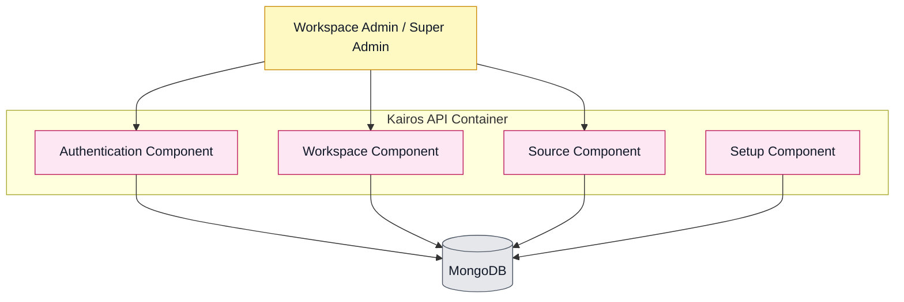
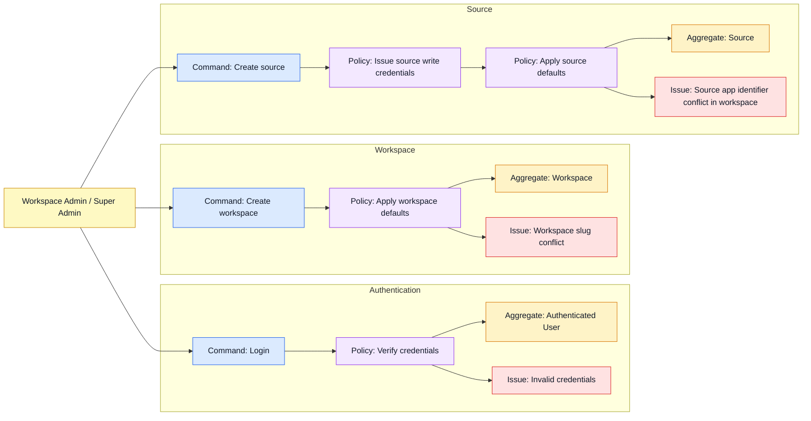

# Living Domain Model

This document describes the current or the implemented domain model for the application. It is a living document that
gets updated as the application evolves. It doesn't represent the future or the ideal state of the domain model, but
rather the current state of the implementation.

## Component Diagram

## Event Storming

Legend:

| Color                      | Meaning               |
|----------------------------|-----------------------|
| Orange                     | Domain events         |
| Light blue                 | Commands              |
| Yellow                     | Aggregates            |
| Red / purple               | Issues                |
| Yellow with stick figure   | User roles / personas |
| Green                      | Views                 |
| Pink notes with solid line | Bounded contexts      |
| Dashed lines               | Subdomains            |
| Arrows                     | Event flow            |
| Purple                     | Policies              |

